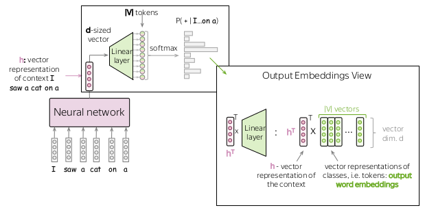

# 3 Language Modeling
Language Models estimate the probability of different linguistic units: symbols, tokens and token sequences.
## 3.1 General framework
- $(y_1,y_2,...,y_n)$ is a sequence of tokens.
- $P(y_1,y_2,...,y_n)$ is the probability to see these tokens in this order:
  $$P(y_1,y_2,...,y_n)=P(y_1)\cdot P(y_2|y_1)\cdot P(y_3|y_1,y_2)\cdot ...\cdot P(y_n|y_1,...,y_{n-1})$$

## 3.2 N-gram Language Models
- The probability of a word only depends on a fixed number ($n-1$) of previous words:
  $$P(y_t|y_1,y_2,...,y_{t-1})=P(y_t|y_{t-n+1},...,y_{t-1})=\frac{N(y_{t-n+1},...,y_{t-1},y_t)}{N(y_{t-n+1},...,y_{t-1})}$$
- But $N(y_{t-n+1},...,y_{t-1},y_t)$ can be zero. 
- Use trigram ($n=3$) if you can. If not, bigram. Else, use unigram.
### 3.2.1 Linear Interpolation
- $P(\text{mat|cat on a}) = \lambda_3 P(\text{mat|cat on a})+\lambda_2 P(\text{mat|on a}) + \lambda_1 P(\text{mat|a}) + \lambda_0 P(\text{mat}), \ \text{with }\sum_i\lambda_i=1$
- Use cross validation to define good $\lambda_i$

But text generated with N-gram language models are **incoherent**.

## 3.3 Neural Language Models (NN-LM)
### 3.3.1 High-level pipeline
Given all previous token sequence as input, use neural network to predict one most possible next word out of the whole vocabulary.

### 3.3.2 Recurrent models
Auto-regressive prediction

## 3.4 Generation Strategies
The generated text has to be **coherent** and **diverse**.
### 3.4.1 Sample with temperature
Use softmax with temperature instead of standard softmax.

### 3.4.2 Top-K Sampling
- Always sample from top-K most probable tokens (K is about 10-50).
- But fixed K is not good.
### 3.4.2 Top-p Sampling
At each step, pick so many top tokens to cover $p%$ of the probability mass.

## 3.5 Evaluation of a language model
- Preplexity: how much is a model surprised when reading a new text.
- Log-likelihood of the text:
  $$L(y_{1:M})=\sum_{t+1}^M\log_2 p(y_t|y_{<t})$$
  $$Preplexity(y_{1:M})=2^{-\frac{1}{M}L(y_{1:M})}$$
- The best preplexity is 1. The worst preplexity is |V|.