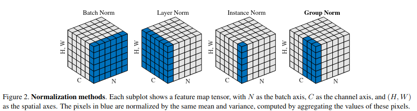

# Normalization

## Batch normalization 
Learnable scale and shift parameters $\gamma, \beta$ makes it easier to train and allows higher learning rate, usually inserted between fc layer / convolution layer and activation layer.

$$y = \gamma(x-\mu)/\sigma+\beta$$

- Training: normalize according to the average of this mini batch.
- Test: Use average of **all training data** to normalize.

### 1D input: batch * feature
Assume the input has shape $N\times D$, the shape of $\beta$ and $\gamma$ would be $1\times D$
### 2D input: batch * sequence * feature
Assume the input has shape $N\times S\times D$, the shape of $\beta$ and $\gamma$ would be $1\times 1\times D$
### 3D input: batch * channel(feature) * height * width
Assume the input has shape $N\times C\times H \times W$, the shape of $\beta$ and $\gamma$ would be $1\times C\times 1\times 1$

## Layer normalization
### 1D input: batch * feature
Assume the input has shape $N\times d$, the shape of $\beta$ and $\gamma$ would be $N\times 1$
### 2D input: batch * sequence * feature
Assume the input has shape $N\times S\times D$, the shape of $\beta$ and $\gamma$ would be $N\times 1\times 1$
### 3D input: batch * channel(feature) * height * width
Assume the input has shape $N\times C\times H \times W$, the shape of $\beta$ and $\gamma$ would be $N\times 1\times 1\times 1$

LayerNorm is widely used for transformers because the sequence length of each instance in nlp tasks are often not the same. And the blank would be filled with 0. If we use layer normalization, the mean would be calculated in terms of each instance and has thus less negative influences.