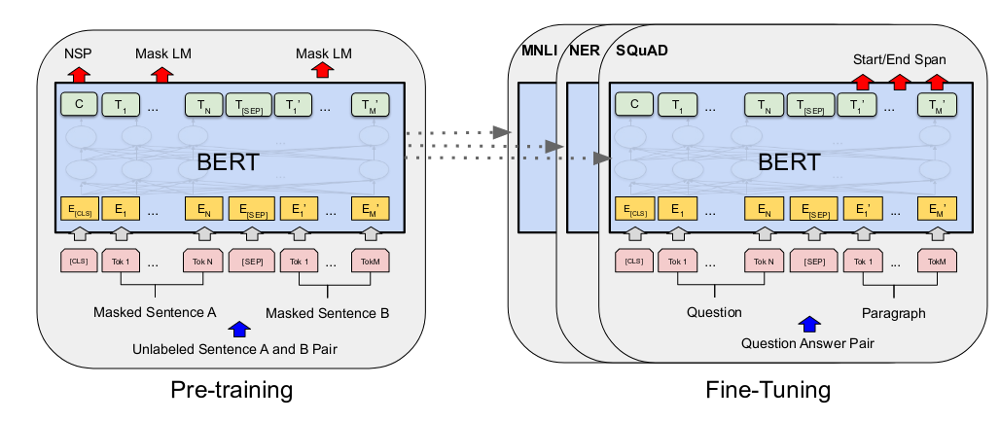
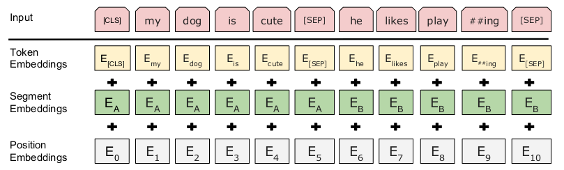

# Bidirectional Encoder Representations from Transformers
## Former works
1. ELMo is feature-based, i.e., uses task-specific architectures that include the pre-trained representations as additional features.
2. GPT is fine-tuning-based, i.e., introduces minimal task-specific parameters, and is trained on the downstream tasks by simply fine-tuning all pretrained parameters.

## Contributions
1. Demonstrate the importance of **bidirectional pre-training** for language representations.
2. Pre-trained representations reduce the need for many heavily-engineered task-specific architectures.

## Algorithm
### Architecture
We denote the number of layers (i.e., Transformer blocks) as $L$, the hidden size as $H$ (denoted as $d_{model}$ [here](Transformer.md)) and the number of self-attention heads as $A$. The number of parameters of the architecture is about $30k\times H+L\times H^2\times12$, where $30k$ is the size of the vocabulary.

### Input
- "Sentence": an arbitrary span of contiguous text instead of an actual linguistic sentence
- "Sequence": the input token to BERT, which may be a single sentence or two sentences packed together depending on the downstream task.
- The first token of every sequence is always a special classification token `[CLS]`. The first hidden state corresponding to this token is used as an **aggregate sequence representation** for classification tasks.
- For sentence pairs, two sentences are separated with a special token `[SEP]`. And a learning embedding (called **segment embedding**) is added to each token to indicate whether it belongs to sentence A or sentence B.

- For a given token, its input representation is the sum of **token embedding, segment embedding and position embedding**. All embeddings (except token embedding) are learnable.

### Pre-training
During pre-training, the model is trained on **unlabeled data** over different pre-training tasks.

- Task 1, Masked Language Model (MLM): token level task. 15 % of all regular (non-special) tokens in each sequence will be randomly masked. Actually, all those tokens would be replaces as `[MASK]` in pre-training. The objective of this task is to predict those masked tokens.
- Task 2, Next Sentence Prediction (NSP): sentence level task. A sentence pair is composed of sentence A and sentence B. However, 50% of the time B is the actual next sentence that follows A (labeled as `IsNext`) and 50% of the time, B is just a random sentence from the corpus (labeled as `NotNext`).

### Fine-tuning
For fine-tuning, the BERT model is first initialized with the pre-trained parameters, and all of the parameters are fine-tuned using labeled data from the downstream tasks. Only task-specific inputs and outputs need to be plugged into BERT.

- MLM: Still 15% of all regular tokens in each sequence will be chosen to prevent the difference between pre-training and fine-tuning, but
  - 80% of the time: replace the word with the `[MASK]` token, same as pre-training.
  - 10% of the time: replace the word with a random word.
  - 10% of the time: keep the word unchanged.