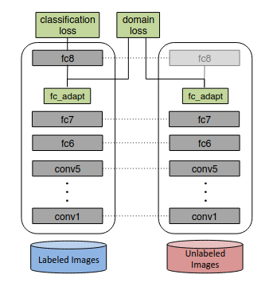

# Domain adaption
Improve the target model performance in the presence of a domain shift between the labeled source domain and unlabeled target domain.
## Discrepancy-based methods
- Deep Domain Confusion: Learn a representation that is both semantically meaningful and domain invariant with a compounding loss. The domain loss (maximum mean discrepancy) measures the distance between distributions of learnt features. Minimizing the domain loss helps to make the features learnt from target data as similar to features learnt from source data.
  
  

## Adversarial-based methods
Adversarial training between category classifier (the real classification we want to conduct) and domain classifier (an auxiliary classifier used to determine whether the input is from source domain or target domain). If the category classifier already works nice, but the domain classifier can hardly classify the domain correctly, the representation we are learning is robust enough.

## Self-training methods
Iteratively using gradually-improving target pseudo-labels to train the network.

# Test-time adaption (TTA)
Source-free domain adaptation. Due to privacy concerns or legal constraints, the source data is generally considered unavailable during inference time.
## TTT: Test-time Training
- Consider a standard K-layer neural network with parameters $\boldsymbol{\theta}_k$ for layer $k$. The stacked parameter vector $\boldsymbol{\theta} = (\boldsymbol{\theta}_1,... , \boldsymbol{\theta}_K)$ specifies the entire classification model.
- Choose a self-supervised auxiliary task (rotation prediction for example, which has been demonstrated to be simple and effective at feature learning for convolutional neural networks.)
- The auxiliary task shares the first $\mathcal{K}\in(1,K)$ layers (**shared feature extractor**) with parameter vector $\boldsymbol{\theta}_e = (\boldsymbol{\theta}_1,... , \boldsymbol{\theta}_{\mathcal{K}})$. After that, the main task branch still utilizes $\boldsymbol{\theta}_m=(\boldsymbol{\theta}_{\mathcal{K+1}},...,\boldsymbol{\theta}_K)$. And the self-supervised task branch uses its own parameter $\boldsymbol{\theta}_s=(\boldsymbol{\theta}_{\mathcal{K+1}}',...,\boldsymbol{\theta}_K')$.
- Train $\boldsymbol{\theta}_e, \boldsymbol{\theta}_m, \boldsymbol{\theta}_s$ in a multi-task fashion on the source (training) data.
- For one single **test sample** $\boldsymbol{x}$, TTT fine-tunes the shared feature extractor $\boldsymbol{\theta}_e$ to $\boldsymbol{\theta}_e^*$  by minimizing the auxiliary task loss on $\boldsymbol{x}$
- The model then makes a prediction using the updated parameters $\boldsymbol{\theta}=(\boldsymbol{\theta}_e^*, \boldsymbol{\theta}_m)$
## TENT: Test entropy minimization
- Objective: minimize the entropy of model predictions. For each target data $\boldsymbol{x}$, we denote its probability to be predicted as class $c$ with $p(\hat y_c)$. Then the entropy for $\boldsymbol{x}$ is :
  $$H=-\sum_cp(\hat y_c)\log p(\hat y_c)$$
  Minimizing the entropy is equivalent to forcing the model to output predictions with **high confidence**.
- Modulation parameters: Instead of choosing model parameters $\boldsymbol{\theta}$ for test-time optimization, TENT updates the normalization statistics $\mu,\sigma$ and affine parameters $\beta,\gamma$ for all BatchNorm layers during testing. Reason is that $\boldsymbol{\theta}$ is the only representation of training/source data. The normalization statistics are estimated for each layer in turn, during the forward pass.The transformation parameters $\beta,\gamma$ are updated by back propagation.

# Continuous Domain Adaptation
Unlike standard domain adaptation which assumes a specific target domain, continuous domain adaptation considers the adaptation problem with continually changing target data.
## IADA: Incremental Adversarial Domain Adaptation for Continually Changing Environments

# Continual Learning
