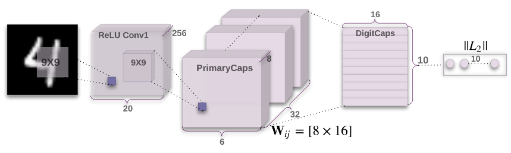
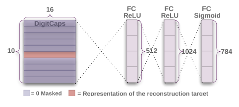

# Dynamic Routing Between Capsules
## Capsule
- A capsule is a group of neurons whose activity vector represents the instantiation (实例化) parameters of a specific type of entity such as an object or an object part.
- We use the **length/norm** of the activity vector to represent the **probability that the entity exists** and its **orientation** to represent **the instantiation parameters**(entity type).

## Contributions
The ability to deal with translation is built in convolution layer, but not for other dimensions affine transformations. Capsules convert pixel intensities into vectors of instantiation parameters of recognized fragments and then apply transformation matrices to the fragments to predict the instantiation parameters of larger fragments. Transformation matrices that learn to encode the intrinsic spatial relationship between a part and a whole constitute viewpoint invariant knowledge that automatically generalizes to novel viewpoints.

## Algorithm
Each layer contains several capsules. Each capsule outputs a **vector**.
### Dynamic Routing
- for all capsule $i$ in layer $l$ and capsule $j$ in layer $(l+1)$: define **initial logits** $b_{ij}\leftarrow 0$
- for $r$ iterations do:
  - for all capsule $i$ in layer $l$: calculate **coupling coefficients** $\boldsymbol{c}_i\leftarrow \text{softmax}(\boldsymbol{b}_i)$
    $$c_{ij}=\frac{\exp(b_{ij})}{\sum_k \exp(b_{ik})}$$
  - Denote the **output vector** of a capsule $i$ in layer $l$ as $\boldsymbol{u}_i$
  - for all capsule $i$ in layer $l$ and capsule $j$ in layer $(l+1)$: calculate **prediction vectors** 
  $$\boldsymbol{\hat u}_{j|i}=\boldsymbol{W}_{ij}\boldsymbol{u}_i$$
  - for all capsule $j$ in layer $(l+1)$: calculate the **total input** 
  $$\boldsymbol{s}_j=\sum_ic_{ij}\boldsymbol{\hat u}_{j|i}$$   
  - for all capsule j in layer $(l+1)$: calculate the **output vector** 
  $$\boldsymbol{v}_j=\frac{||\boldsymbol{s}_j||^2}{1+||\boldsymbol{s}_j||^2}\frac{\boldsymbol{s}_j}{||\boldsymbol{s}_j||}$$
  - for all capsule $i$ in layer $l$ and capsule $j$ in layer $(l+1)$: calculate the **agreement** 
  $$a_{ij}=\boldsymbol{v}_j\cdot \boldsymbol{\hat u}_{j|i}$$
  - for all capsule $i$ in layer $l$ and capsule $j$ in layer $(l+1)$: update the logits $b_{ij}=b_{ij}+a_{ij}$

### Analysis
1. coupling coefficients $\boldsymbol{c}_i= \text{softmax}(\boldsymbol{b}_i)$: How different predictions from capsule at one level affect the instantiation parameters of higher-level capsules.
2. prediction vector $\boldsymbol{\hat u}_{j|i}=\boldsymbol{W}_{ij}\boldsymbol{u}_i$: Active capsules at one level make predictions, via transformation matrices, for the instantiation parameters of higher-level capsules.
3. total input $\boldsymbol{s}_j=\sum_ic_{ij}\boldsymbol{\hat u}_{j|i}$: When multiple predictions agree (similar direction), the higher level capsule becomes active (long).
4. output vector $\boldsymbol{v}_j=\text{squash}(\boldsymbol{s}_j)$: Non-linear squashing ensures that short vectors get shrunk to almost zero lenth and long vectors get shrunk to a length slightly below 1.
5. agreement $a_{ij}=\boldsymbol{v}_j\cdot \boldsymbol{\hat u}_{j|i}$: How the lower-level predictions agree with the instantiation parameters of higher-level capsules.
6. logits $b_{ij}=b_{ij}+a_{ij}$: update the logits with the agreement between capsules.

$\boldsymbol{W}_{ij}$ is still updated with back propagation.

### CapsNet architecture for MNIST

1. Conv1: A Convolution layer with $256, 9\times9$ kernels with a stride of 1 and ReLU activation. The output has shape $(256,20\times20)$
2. PrimaryCaps: A Convolution capsule layer (which is equivalent to a Convolution layer with squashing as non-linear activation) with 32 channels. **No routing here since the output of COnv1 is 1D and has thus no orientation.**
  - Each capsule contains $8$ convolution units with $9\times9$ kernel and a stride of 2. So the output is a 8D vector.
  - Each channel contains $6\times6$ capsules. $(20-9+1)//2=6$
  - Each capsule in the $6\times 6$ grid is sharing their weights with each other.
  - The output has shape $(32,6\times6, 8)$
3. DigitCaps: **Dynamic routing here with $i\in(1, 32\times6\times6)$ and $j\in(1,10)$**
  - The length/norm of the activity vector of each capsule in DigitCaps layer indicates presence of an instance (digit) of each class.

### Reconstruction as a regularization method

1. Mask out all but the activity vector of the correct digit capsule.
2. Feed the representation into a decoder consisting of 3 fully connected layers
3. Minimize the sum of squared differences between the outputs of the logistic units and the pixel intensities.

## Results
Results show that each DigitCaps capsule learns a more robust representation for each class than a traditional convolutional network.