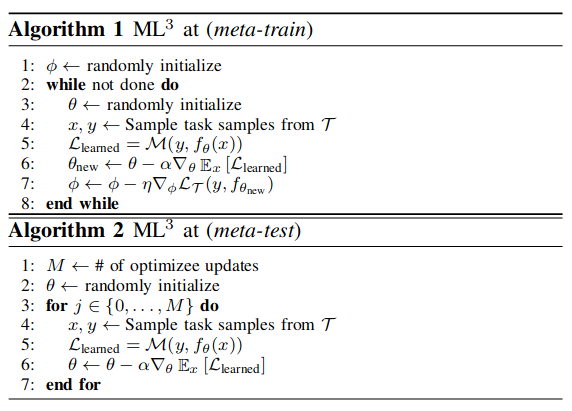

# Meta Learning via Learned Loss
## Meta-learning: learning to learn
- Approaches that learn representations that can generalize and are easily adaptable to new tasks.
- Approaches that learn how to optimize models, how to converge faster on new tasks. (**Focus of this paper**)
### Meta-train
Learning to learn by
- formulating a better loss
- optimizing the model in a better way
- ...
### Meta-test
Evaluate whether the model learns learning capability by meta-training a **randomly initialized** model **on out-of-distribution tasks**. Compare the performance of meta-test with regular training process.
## A regular gradient based learning process
$$\theta_{new}=h_{\alpha}(\theta,\nabla_\theta\mathcal{L}_\phi(y,f_{\theta}(x)))$$
- $f_\theta(x)$: optimizee / model 
- $\mathcal{L}_\phi$: loss function
- $h_\alpha$: gradient transform / optimizer policy

1. model parameters $\theta$ can be meta-learned in order to be easily adapted to new tasks.
2. loss parameters $\phi$ can be meta-learned to improve the loss function. (**Focus of this paper**)
3. optimizer parameters $\alpha$ can be meta-learned to strengthen the optimizer policy.

## Contributions
1. Present a framework for learning adaptive, high-dimensional loss functions through back-propagation that create the loss landscapes for efficient optimization with gradient descent.
2. Present several ways our framework can incorporate extra information that helps shape the loss landscapes at meta-train time.

## Algorithm
Goal: learn a **meta-loss** function $\mathcal{M}_\phi$, and the optimization process would be:
$$\theta_{new}=\theta-\alpha\nabla_{\theta}\mathcal{L}_{learned},\ \text{where }\mathcal{L}_{learned}=\mathcal{M}_\phi(y,f_{\theta}(x))$$
### $ML^3$ (Meta-Learning via Learned Loss) for supervised learning
- Goal: learn a **meta-loss** function $\mathcal{M}_\phi$, and the optimization process would be:
  $$\theta_{new}=\theta-\alpha\nabla_{\theta}\mathcal{L}_{learned},\ \text{where }\mathcal{L}_{learned}=\mathcal{M}_\phi(y,f_{\theta}(x))$$
  $$\nabla_{\theta}\mathcal{M}_{\phi}(y, f_{\theta}(x))=\nabla_f(\mathcal{M}_{\phi}(y, f_{\theta}(x)))\nabla_\theta f_\theta(x)$$
- Changing $\phi$ would lead to different $\theta_{new}$. A **task-loss** during **meta-train** time is necessary to evaluate $\theta_{new}$. Extra information can be introduced into the task-loss (not covered here). Taking MSE as an example, the task-loss would be:
  $$\mathcal{L}_{\mathcal{T}}=(y-f_{\theta_{new}}(x))^2$$
  $$\nabla_{\phi}\mathcal{L}_{\mathcal{T}}=\nabla_f\mathcal{L}_{\mathcal{T}}\nabla_{\theta_{new}}f_{\theta_{new}}\nabla_\phi\theta_{new}=\nabla_f\mathcal{L}_{\mathcal{T}}\nabla_{\theta_{new}}f_{\theta_{new}}\nabla_\phi[\theta-\alpha\nabla_{\theta}\mathcal{M}_\phi(y,f_{\theta}(x))]$$

- Meta-train: learn an optimal $\phi$ instead of an optimal $\theta$. Step 6 (update $\theta$ with fixed $\mathcal{M}_{\phi}$) can be repeated multiple times.
- Meta-test: Compare the convergence performance of training with meta-trained loss and regular loss.