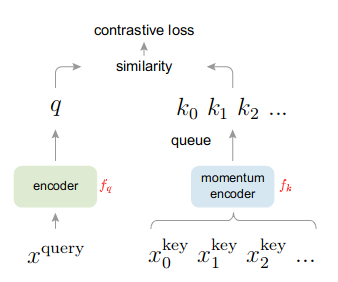
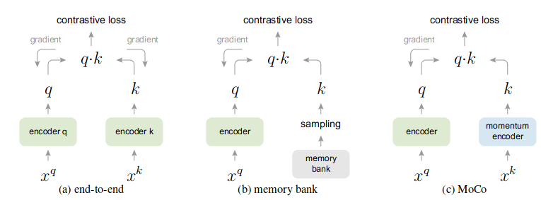
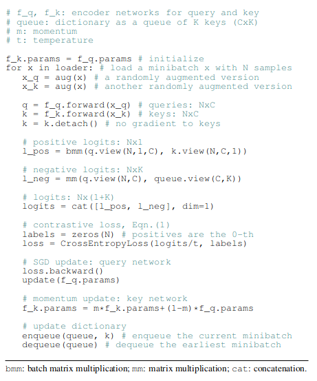

# Momentum Contrast for Unsupervised Visual Representation Learning
## Momentum
$$y_t=m\cdot y_{t-1}+(1-m)\cdot x_t$$
where $y_t$ is the output, $x_t$ is the input, and $m$ is the hyperparameter momentum.
## Contrast Learning: an unsupervised visual representation learning
- Learn similar representations for similar images
- Learn discriminant representations for very different images.
- But how to distinguish whether two images are similar or not in an unsupervised way? Pretext tasks!
  - **Instance discrimination**: Given a dataset $X_1,...,X_N$:
    - $X_i^1$ and $X_i^2$, two images cropped and augmented from $X_i$, are similar. We call $X_i^1$ as the **anchor** and $X_i^2$ as the **positive sample**.
    - $X_i^1$ and $X_j$ are not similar as long as $i\neq j$. All $X_j$s are called **negative samples**.

## Why is unsupervised learning so successful in NLP but not in CV?
- Language tasks have **discrete signal spaces** (words, sub-word units, etc.) for building tokenized dictionaries, on which unsupervised learning can be based.
- Computer vision, in contrast, further concerns dictionary building, as the raw signal is in a **continuous, high-dimensional space**.

## Contributions
1. MoCo treats contrastive learning as a **dictionary look-up problem.** So the anchor is called **query** and positive/negative samples are called **key**s.
2. Provides a way to build **large** and **consistent** dictionaries for unsupervised learning. A larger dictionary may better sample the underlying continuous, high dimensional visual space, while the keys in the dictionary should be represented by the same or similar encoder so that their comparisons to the query are consistent.

## Related Work
1. Loss functions:
   1. L1 or L2 losses can be used to measure the difference between a model's prediction and a **fixed** target.
   2. Contrastive losses measure the similarities of sample pairs in a **representation space**. The target itself, i.e. the representation of the anchor, **varies** during training.
   3. Adversarial losses measure the difference between probability distributions.
2. Pretext tasks

## Algorithm

### Contrastive learning as Dictionary Look-up
- Consider an encoded query $q$ and a set of encoded samples $\{k_0,k_1,...\}$ that are the keys of a dictionary. 
- Assume that there is a single key (denoted as $k_+$) in the dictionary that $q$ matches.
- The contrastive loss should be low when $q$ is similar to $k_+$ and dissimilar to all other keys.
- The contrastive loss used in this paper is InfoNCE loss:
  $$\mathcal{L}=-\log\frac{\exp(q\cdot k_+/\tau)}{\sum_{i=0}^K\exp(q\cdot k_i/\tau)}$$
  where one positive sample and $K$ negative samples are considered. And the loss is basically a cross entropy loss that tries to classify $q$ as $k_+$.

### Momentum Contrast
#### Dictionary as a queue
- A large dictionary is necessary for contrast learning, but is too overwhelming for computers. So MoCo maintains the dictionary as a **queue** of data samples. 
- The dictionary is built as a queue of encodings, with **the current mini-batch enqueued and the oldest mini-batch dequeued**. Because the oldest mini-batch is encoded by the most outdated encoder and thus also the **least consistent** with the newest ones.
- Thus the dictionary size is decoupled from the the mini-batch size. The dictionary size can be much larger than a typical mini-batch size.

#### Momentum update
- Using a queue can make the dictionary large, but it also makes it **intractable** to update the key. (Because only one mini-batch is encoded by the current encoder, but the gradient should propagate to all samples in the queue)
- A naive solution is to copy the key encoder $f_k$ from $f_q$, but the rapidly changing $f_q$ reduces the key representations' consistency.
- If we denote the parameters of $f_k$ as $\theta_k$ and those of $f_q$ as $\theta_q$. Momentum update in MoCo is actually:
  $$\theta_k\leftarrow m\theta_k+(1-m)\theta_q$$
  Here $m=0.999$ is a momentum coefficient and only $\theta_q$ is updated by back-propagation. And the momentum update makes $\theta_k$ evolve more smoothly than $\theta_q$.

## Difference to other contrastive mechanisms

- end-to-end: encoder $f_q$ and encoder $f_k$ evolve simultaneously. As a result, dictionary size has to be equal to mini-batch size. Consistent but not large enough.
- memory bank: first, offline feature extraction constructs the memory bank. During training, replace the sampled encodings in the memory bank with new encoding encoded by the updated encoder $f_q$. As a result, representations in the memory bank are updated very slowly and are not consistent. Large but not consistent.

## Pseudo code

- $N=256$: batch size
- $C=128$: encoding dimension
- $K=65536$: dictionary size, which is also the size of the queue. Note that no positive samples are considered in the queue