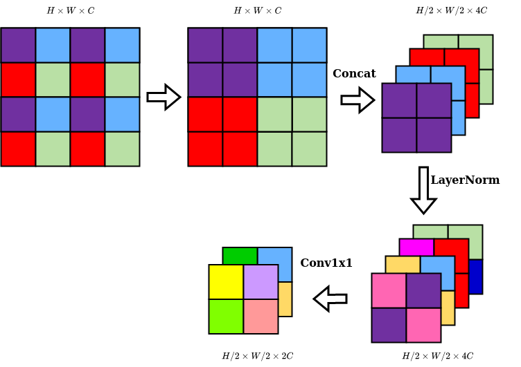
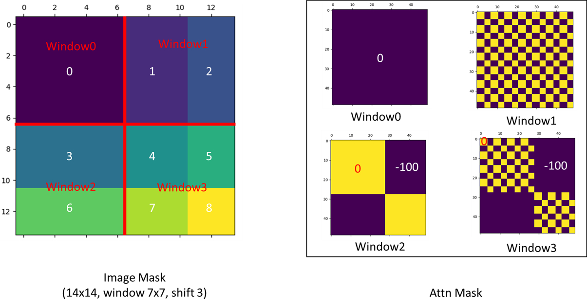

# Swin Transformer: Hierarchical Vision Transformer using Shifted Windows
## Challenges in adapting Transformer from language to vision
1. Large variations in the scale of visual entities. Same semantic objects may have significant different scales.
2. High resolution

## Contributions
1. The shifted windowing scheme brings greater efficiency by limiting self-attention to non-overlapping local windows while also allowing for **cross-window connection**.
2. The standard Transformer architecture and ViT both conduct global self-attention, where the relationships between a token and all other tokens are computed. The global computation leads to **quadratic** complexity with respect to the number of tokens, making it unsuitable for many vision problems requiring an immense set of tokens for dense prediction or to represent a high-resolution image. The hierarchical architecture has the flexibility to model at **various scales** and has **linear** computational complexity.
4. Swin Transformer can serve as a general-purpose backbone.

## Algorithm

- Patch partition: partition the image to patches of $4\times 4$. So the feature dimension would be $3\times 4\times 4=48$ before linear embedding.
- Linear embedding: project the feature to a random dimension (denoted as $C$)
- Swin Transformer Block: conducts self-attention within local windows and maintains the sequence length ($H/4*W/4$)
- Patch Merging(Similar as Pooling):
  1. Anti-flatten the sequence output from transformer back to 3d.
  2. Rearrange the input with a stride of 2. 
  3. Concatenate the new four windows along the channel dimension. 
  4. LayerNorm
  5. Convolution layer with kernel $1\times 1$ to change the channel dimension.
   
  

### Swin Transformer Block: Shift Window based Self-Attention

- Self-attention in non-overlapped windows
  - Partition the input to $h\times w$ ($h=H/4, w=W/4$) non-overlapped patches.
  - Adjacent $M\times M$ patches construct a window, thus $h/M\times w/M$ windows.
  - Calculate the self-attention within each local window.
  - According to [computational complexity of MSA](Transformer.md#13-computational-complexity-of-a-multi-head-self-attention-layer), the computational complexity for each window ($n=M^2, d_{model}=C$) is $4M^2C^2+2M^4C$.
  - As a result, the total computational complexity of window-based Multi-head self-attention module is:
  $$\Omega(\text{W-MSA})=h/M\times w/M\times (4M^2C^2+2M^4C)=4hwC^2+2M^2hwC$$
  - While the total computational complexity of a regular Multi-head self-attention module is:
  $$\Omega(\text{MSA})=4hwC^2+2(hw)^2C$$
  - Global self-attention computation is **quadratic** (generally unaffordable for a large $hw$), while the window based self-attention is **linear** (scalable).
- Shifted window partitioning in successive blocks
  - The window-based self-attention module lacks connections across windows, which limits its modeling power.
  - The next module adopts a windowing configuration that is shifted from that of the preceding layer, by displacing the windows by $(\lfloor M/2\rfloor, \lfloor M/2\rfloor)$ patches from the regularly partitioned windows.
  - Two successive swin transformer blocks can be represented as in [Algorithm (b)](#algorithm):
  $$\hat{z}^l=\text{W-MSA}(\text{LN}(z^{l-1}))+z^{l-1},\\
  z^l=\text{MLP}(\text{LN}(\hat{z}^l))+\hat{z}^l,\\
  \hat{z}^{l+1}=\text{SW-MSA}(\text{LN}(z^l)+z^l,\\
  z^{l+1}=\text{MLP}(\text{LN}(\hat{z}^{l+1}))+\hat{z}^{l+1}$$
- Efficient batch computation for shifted configuration
  
  - An issue with shifted window partitioning is that it will result in more windows, from $\lceil h/M\rceil \times \lceil w/M\rceil$ to $(\lceil h/M\rceil+1) \times (\lceil w/M\rceil+1)$ in the shifted configuration, and some of the windows will be smaller than $M \times M$
  
  

  - Cycle-shifting the windows can reduce the number of windows back to $\lceil h/M\rceil \times \lceil w/M\rceil$. But there occurs another problem. Self-attention should not be calculated between the (original) top patches and (original) bottom patches. So masked MSA needs to be introduced.
  
  
  - Because the self-attention matrix is the Softmax activation of the matrix product of $\boldsymbol{Q}$ and $\boldsymbol{K}$ and they come from the same input in MSA, an efficient approach is to mask off the elements that are products of two windows by adding a negative value (-100) to the product.
    - For example, if we observe window2, the top left corner and bottom right corner are respectively self-attention matrix of original 3 and original 6. And the top right corner and bottom left corner are kind of calculating the attention between original 3 and original 6.
    - Since the products are relatively small, adding a negative value (e.g. -100) can reduce the softmax activation to basically 0.
    - As a result, the weighted sum would be equivalent to calculating within original 3 and 6