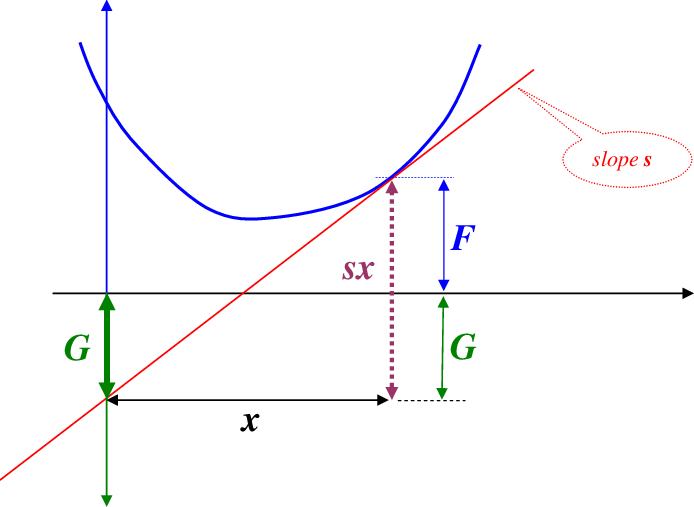
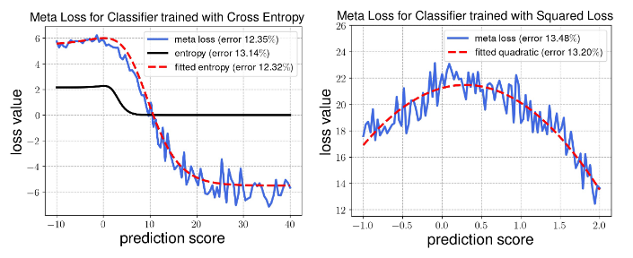

# Test-Time Adaption via Conjugate Pseudo-labels
## Background
Test-Time Adaption (TTA) adapts neural networks to domain shifts with access to only the unlabeled target domain at test-time. [TENT](Domain%20Adaption%20(Survey).md#tent-test-entropy-minimization) optimizes over unsupervised entropy objectives (TTA loss). It remains unclear how to choose or guide the selection of this TTA loss, and thus far, the choice of these losses has remained largely heuristic in nature.

But how about using [meta learning](ML3.md) to learn an optimal loss for TTA? Answer to this question at first glance is No! Because meta-learning requires labeled test data to tell whether a loss is good or not. But the label of test data is inaccessible in TTA. But meta-learning can be used to explore what the best unsupervised TTA losses look like.

## Legendre Transform
The Legendre transform of $f(x)$ is 
$$G(s)=s^Tx-f(x)$$
- $s=\nabla_xf(x)$, so $s^Tx$ represents the tangent 
- $G(s)=s^Tx-f(x)$ represents the negative intercept (截距)

Legendre Transform outputs a new function model that map between the slope and the intercept. But Legendre Transform can not deal with non-differentiable or non-convex (same $s$ may be projected to different $G(s)$) $f(x)$.

## Convex Conjugate
The convex conjugate of $f(x)$ is
$$f^*(s)=\sup_{x\in\mathcal{D}}\{s^Tx-f(x)\}$$
- $\sup_{x\in\mathcal{D}}$: supremum (上确界、最小上界) inside the definition area $\mathcal{D}$. The convex conjugate can deal with non-convex $f(x)$.
- $f^*(s)$ is convex regardless of whether $f(x)$ is convex or not.
- For a given slope $s$, $f^*(s)$ is the **maximum** of $s^Tx-f(x)$
- In other words, the convex conjugate fulfills
$$-f^*(y)=\min_x\{f(x)-y^Tx\}$$
- For convex $f$ (the derivative of a convex function is monotonous):
  $$f^*(\nabla f(x))=\nabla f^T(x)x-f(x)$$

##  Notation
- $h,\ h_{\theta}(x)$: source model / hypothesis function
- $y$: label
- $\mathcal{L}(h(x), y)=f(h(x))-y^Th(x)$: this holds for several common losses like cross-entropy and the squared loss.
  - cross-entropy: $h(x)$ represents the logits, $y$ is an one-hot encoding.
    $$\mathcal{L}(h(x), y)=-\sum_iy_i\log\frac{\exp(h_i)}{\sum_j\exp(h_j)}=\sum_iy_i\log(\sum_j\exp(h_j))-\sum_iy_ih_i=\log(\sum_j\exp(h_j))-\sum_iy_ih_i=\log(\sum_i\exp(h_i))-y^Th$$
  - squared loss: $h(x)$ represents the direct predictions of the regressor, $y$ is the label.
    $$\mathcal{L}(h(x), y)=\frac{1}{2}\sum_i(h_i-y_i)^2 = \frac{1}{2}\sum_ih_i^2-h_iy_i+y_i^2 \overset{\text{ignore constant}}{=}\frac{1}{2}||h||_2^2-y^Th$$
- $f^*$: convex conjugate function
- $h^*, h_{\theta^*}(x)$: optimal $h$, not related to convex conjugate
- $m_\phi(h)$: loss function approximated via a neural network.

## PolyLoss
PolyLoss is a simple alternative to cross-entropy loss that has been shown to improve performance across a wide variety of tasks.

$$\begin{equation}
\tag{PolyLoss}
\mathcal{L}_{poly}(h_\theta(x),y)=L_{ce}(h_\theta(x),y)+\epsilon\cdot y^T(1-\text{softmax}(h_\theta(x)))
\end{equation}$$

## Contributions
1. Meta-learn TTA loss over a wide class of source models. Softmax-entropy TTA loss is only optimal when the source model is trained with cross-entropy loss.
2. The training losses's (unsupervised) convex conjugate function recovers the best TTA losses found by meta-learning.
3. The conjugate based approach can also be interpreted as a kind of self-training using a very specific soft label, which we refer to as the conjugate pseudolabel.

## Algorithm
### Meta learning the loss function
Similar as the procedure described in [ML3](ML3.md)
- Train source model in a supervised way.
- Parameterize the loss function via a neural network $m_\phi$ that takes in the model predictions/logits and outputs a loss value.
- Meta-train (**Do we need to randomly initialize $\theta$ after updating $\phi$ as in [ML3](ML3.md)?**)
  - Update model parameters $\theta$. $m_\phi$ is just a neural network.
  $$\theta^{t+1}\leftarrow\theta^t-\alpha\frac{\partial m_{\phi^t}(h_{\theta^t}(x))}{\partial \theta^t}$$
  - Update loss parameters $\phi$. $\mathcal{L}(h,y)$ is a **supervised** predefined loss, like cross entropy, to measure the quality of the loss.
  $$\phi^{t+1}\leftarrow\phi^t-\beta\frac{\partial \mathcal{L}(h_{\theta^{t+1}}(x), y)}{\partial \phi^t}$$
- Meta-test

## Results

Across different architectures and different variants of meta-learning, for a classifier trained with cross-entropy, the meta-TTA loss was temperature scaled softmax-entropy and for a classifier trained with squared loss, the meta-TTA loss was a negative squared loss.

- softmax-entropy 
  $$\alpha\cdot\mathcal{H}(\text{softmax}(h_\theta(t)/T))$$
  - $\alpha$: magnitude parameter
  - $\mathcal{H}$: entropy function
  - $T$: temperature scaler

## Analysis
### Conjugate adaption loss
- Loss function between a hypothesis $h_\theta(x)$ and target $y$ can be rewritten as 
  $$\begin{equation}
    \tag{original loss}    
    \mathcal{L}(h_\theta(x), y)=f(h_\theta(x))-y^Th_\theta(x)
    \end{equation}$$
- The training process can be roughly viewed as attaining the minimum over hypothesis $h$ for each training example:
  $$\min_h\frac{1}{n}\sum_{i=1}^n\mathcal{L}(h(x_i),y_i)\approx\frac{1}{n}\sum_{i=1}^n\min_h\mathcal{L}(h(x_i),y_i)$$
- Minimizing loss for each training example is the well-known optimization **convex conjugate** problem:
  $$\min_h\{\mathcal{L}(h(x),y)\}=\max_h\{f(h(x))-y^Th(x)\}=-f^*(y)$$
- From a different perspective, the optimal $h^*$ should fulfill:
  $$\nabla \mathcal{L}(h,y)=\nabla f(h^*)-y=0\Rightarrow y=\nabla f(h^*)$$
- Combining the three equations above, we can have
  $$\frac{1}{n}\sum_{i=1}^n\mathcal{L}(h_{\theta^*}(x_i),y_i)\approx\frac{1}{n}\sum_{i=1}^n-f^*(\nabla f(h_{\theta^*}(x_i)))$$

To sum up, the empirical loss can be approximated by the (negative) conjugate applied to the gradient of the $f$, at least in a region close to the optimal $\theta^*$ that minimizes the empirical loss. But the later expression has the notable benefit that **it does not require any label $y_i$ and thus can be used as basis for TTA on target domain of $h_{\theta^*}$**. So we define ***conjugate adaption loss*** as
$$L^{conj}(h_\theta(x))=-f^*(\nabla f(h_{\theta}(x_i)))$$

Minimizing the conjugate adaption loss is a necessary condition instead of a sufficient condition of the optimal $\theta^*$.

- Cross-entropy:
  - $$f(x)=\log\sum_i\exp(h_i)$$
  - $$y=\nabla f(h)=\frac{\exp(h)}{\sum_i\exp(h_i)}$$
  - $$f^*(y)=\left\{\begin{aligned}&\sum_iy_i\log y_i\ &\text{if }\sum_i y_i=1 \\ &\infty &\text{otherwise}\end{aligned}\right.$$
  - $$L^{conj}(h_\theta(x))=-\sum_i\frac{\exp(h_i)}{\sum_j\exp(h_j)}\log\frac{\exp(h_i)}{\sum_j\exp(h_j)}$$

### Conjugate pseudo-labels
Conjugate adaption loss is equal to original loss applied to the "pseudo-labels"
$$\begin{equation}
\tag{conjugate pseudo-labels}
y_\theta^{\text{CPL}}(x)=\nabla f(h_\theta(x))
\end{equation}$$

In other words, the conjugate adaption loss is precisely equivalent to self-training under the specific soft pseudo-labels $y_\theta^{\text{CPL}}(x)$
$$\mathcal{L}^{conj}(h_\theta(x))=\mathcal{L}(h_\theta(x),\nabla f(h_\theta(x)))$$

And self-training with conjugate pseudo labels $y_\theta^{\text{CPL}}(x)$ is more convenient than explicitly computing the conjugate function $f^*(y)$.

### Conjugate pseudo-labels for PolyLoss
- Compared to using cross-entropy loss:
  $$\mathcal{L}_{ce}(h_\theta(x), y)=f(h_\theta(x))-y^Th_\theta(x)$$
- The PolyLoss can be reformulated with
  $$\mathcal{L}_{poly}(h_\theta(x), y)=f(h_\theta(x))-y^Tg(h_\theta(x)),\ \text{with }g(h)=h-\epsilon(1-\text{softmax}(h))$$
- Define $h_\theta'(x)=g(h_\theta(x))$
- Define PolyLoss in conjugate form:
  $$\mathcal{L}_{poly}(h_\theta'(x), y)=f(g^{-1}(h_\theta'(x)))-y^Th_\theta'(x)$$