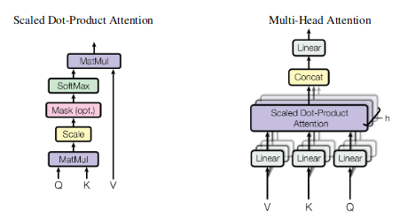
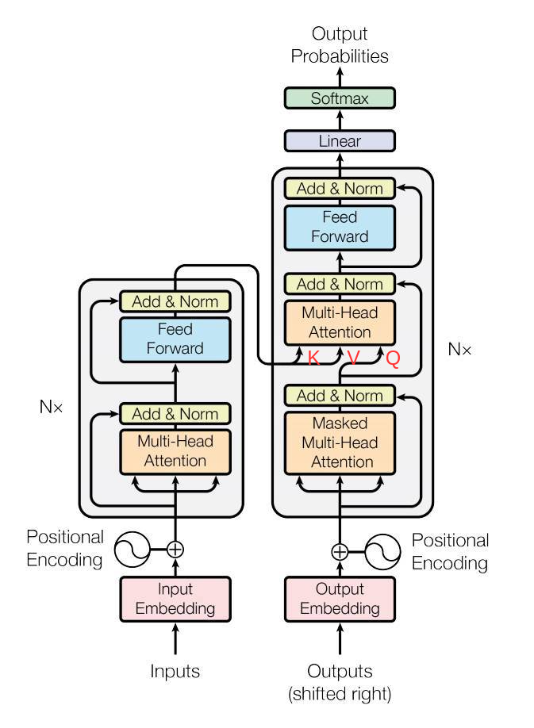

# 1 Attention: mapping a query and key-value pairs to an output
The output is computed as a weighted sum of the values, where the weight assigned to each value is computed by a compatibility function of the query with the corresponding key.
  

## 1.1 Scaled Dot-Product Attention
$$Attention(\boldsymbol{Q},\boldsymbol{K},\boldsymbol{V}) = softmax(\frac{\boldsymbol{Q}\boldsymbol{K}^T}{\sqrt{d_k}})\boldsymbol{V}$$

- $\boldsymbol{Q}: [n_q, d_k]$, queries
- $\boldsymbol{K}: [n_k, d_k]$, keys
- $\boldsymbol{V}: [n_k, d_v]$, values
- $Attention(\boldsymbol{Q},\boldsymbol{K},\boldsymbol{V})$: $[n_q, d_v]$
  
- Softmax operation is performed on each row (query)
- For larger values of $d_k$, the products become **extremer** in magnitude, pushing softmax function into regions with extremely small gradients.

## 1.2 Multi-Head Attention (self-attention case)
- It's more beneficial to linear project the queries, keys and values **h times** with different, learned linear projections. And then concatenate the outputs and once again linear project the contenation

$$\boldsymbol{head}_i = Attention(\boldsymbol{Q}\boldsymbol{W_i^Q}, \boldsymbol{K}\boldsymbol{W_i^K}, \boldsymbol{V}\boldsymbol{W_i^V})$$
- $\boldsymbol{Q}, \boldsymbol{K}, \boldsymbol{V}: [n, d_{model}], [n, d_{model}], [n, d_{model}]$ in self-attention case
- $\boldsymbol{W_i^Q}: [d_{model}, d_k]$
- $\boldsymbol{W_i^K}: [d_{model}, d_k]$
- $\boldsymbol{W_i^V}: [d_{model}, d_v]$
- Specifically, $d_k=d_v=d_{model}/h$ for simplicity
- $\boldsymbol{head}_i:[n, d_v]$
$$MultiHead(\boldsymbol{Q}, \boldsymbol{K}, \boldsymbol{V}) =Concat(\boldsymbol{head}_1,...,\boldsymbol{head}_h)\boldsymbol{W^O}$$
- $Concat(\boldsymbol{head}_1,...,\boldsymbol{head}_h): [n, hd_v=d_{model}]$
- $\boldsymbol{W^O}: [hd_v=d_{model}, d_{model}]$
- $MultiHead(\boldsymbol{Q}, \boldsymbol{K}, \boldsymbol{V}): [n, d_{model}]$
  
# 2 Vanilla Transformer

## 2.1 Encoder
The encoder is composed of a stack of $N=6$ identical layers. Each layer has two sub-layers: multi-head self-attention mechanism and a position-wise Feed-Forward Network
### 2.1.1 Self-attention layer
In a self-attention layer in the encoder, all of the keys, values and queries are the same, i.e. the output of the previous layer in the encoder. Thus, **each position in the encoder can attend to all positions in the previous layer of the encoder**

### 2.1.2 Position-wise Feed-Forward Networks
FFN consists of 2 FC layers with a ReLU activation in between. Typically, the size of the hidden layer is $4\times d_{model}$

## 2.2 Decoder
The Decoder is also composed of a stack of $N=6$ identical layers. In addition to the two sub-layers in Encoder, the decoder inserts a layer, which performs multi-head attention over the output of **encoder stack**.
### 2.2.1 First attention layer: self-attention layer
- Input: $\boldsymbol{Q}, \boldsymbol{K}, \boldsymbol{V}$ are all from the output of the **encoder stack** / output of last decoder layer.
- Aim: gradually generate useful queries for latter use
- Mask(optional): Inputs need to be shifted right for one step, so that each position in the decoder is allowed to attend to all positions in the decoder **up to and including** that position.

### 2.2.2 Second attention layer: Encoder-Decoder Attention
- Input:
  - $\boldsymbol{K}, \boldsymbol{V}$ are from the embeddings
  - $\boldsymbol{Q}$ comes from previous self-attention layer.

## 2.3 Positional encoding
In order for the model to make use of the order of the sequence, information about the relative or absolute position of the tokens in the sequence has to be injected.

$$PE_{(pos, 2i)}=\sin\left(pos/10000^{2i/d_{model}}\right)\\ PE_{(pos, 2i+1)}=\cos\left(pos/10000^{2i/d_{model}}\right)$$
- $pos$: position in the sequence
- $i\in [0, d_{model}//2]$: dimension
- Each dimension of the positional encoding corresponds to a sinusoid 

## 2.4 Advantages of self-attention
- Complexity per layer: faster if sequence length $n <$ dimension $d$
  - self-attention: $O(n^2d)$
  - recurrent: $O(nd^2)$
- Larger amount of computation that can be parallelized
- Easier to learn long-range dependencies
