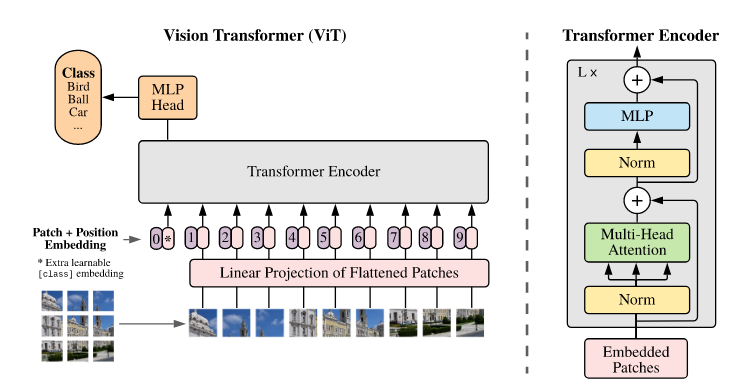

# Vision Transformer
## Constraints of using Transformers in computer vision
Self-attention layer needs to calculate the inner product between all possible token pairs. As a result, the computation complexity is about $O(n^2)$, where $n$ is the sequence length. In [BERT](BERT.md), $n=512$. However, if we take every pixel in a $224\times 224$ image as a token, i.e., $d_{model}=3$, $n=224*224=50176$ which is 100 times larger than $512$.

## Algorithm
1. Split an image into fixed-size patches, e.g. $16\times 16$ patches. As a result, an image of size $224\times 224$ can be represented as a sequence of $(224/16\times 224/16)\times (16\times 16\times 3)=196\times 768$, where 196 is the sequence length $n$ and 768 is $d_{model}$
2. Project each of those patches through a FC layer to generate embeddings. Similar as using `[CLS]` in BERT, an extra **learnable** embedding is also needed to represent the aggregate sequence representation for classification tasks.
3. Add position embedding to all patches.
4. Go through Transformer encoder and classify.

## Comparison between ViT and CNN-based networks
1. ViT yields a result that is a few percentage points below ResNets of comparable size, because of the lack of some inductive bias that CNN-based networks have:
   - Locality: Inputs that are close to each other (pixels in the image) are related, whereas inputs that are further away are less related.
   - Translation equivariance: $f(g(x))=g(f(x))$ where $f$ means a convolution operation and $g$ represents a translation operation.
2. ViT needs to be pretrained on large datasets, but Transformer is not prone to overfit.

## Positional encoding
- 1-dimensional positional embedding: Considering the inputs as a sequence of patches.
- 2-dimensional positional embedding: Considering the inputs as a grid of patched in two dimensions. Two sets of embeddings are learned, each for one axis and each with size $D/2$. Then, **based on the coordinates**, we concatenate the X and Y embeddings to get the final positional embedding.